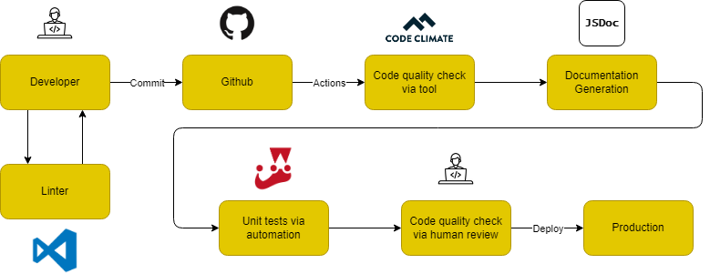

# CI/CD Pipeline Phase 1

## What is currently functional
- Homepage 
- Settings Page Button

## What is Planned/In Progress
- Learn more page
- Check your compatability 
- "Your horoscope is..." feature

## CI/CD Pipeline Diagram

<!---  Use phase1.png, phase1.drawio.png doesn't have some icons show up for some reason, and if you want to make edits, export as .drawio file and import into https://app.diagrams.net/ -->

## Linting and Code Style Enforcement
We are using VSCode for linter...

## Code Quality Via Tool
We are using CodeClimate to enforce code quality. It will help us to write pure code, which will be easy-to-read and have practical results. 

## Code Quality Via Human Review
We are also checking code quality manually. For example, PULL REQUESTS. 

## Unit Tests Via Automation
We are using Jest to write our unit tests. It is important to write unit tests to make sure our code works as expected. We need to make sure there are no bugs, edge cases, or other bad things that the user could encounter. 

## Documentation Generation Via Automation
We are using JSDocs...

