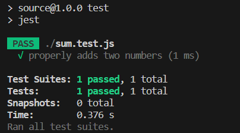

# unit tests via automation

Unit tests via automation refer to the practice of automating the execution of unit tests in software development. Unit tests are a type of testing that focuses on verifying the functionality of individual units or components of code in isolation. These tests are typically written by developers and aim to test small, independent pieces of code, such as functions or methods, to ensure they work correctly.

process typically works:

* Test Frameworks/Libraries: Developers write unit tests using testing frameworks or libraries specific to their programming language or development ecosystem. These frameworks provide tools, APIs, and utilities for organizing and executing tests.

* Test Cases: Developers define test cases that cover various scenarios and edge cases for the units of code being tested. Each test case typically includes a set of inputs and expected outputs or assertions.

* Test Execution: Automated test runners or build systems are set up to execute the unit tests. These tools automatically discover and execute the tests, usually by scanning specific directories or files containing test code.

* Assertions: Within the unit tests, developers use assertion libraries or built-in assertion functions to verify expected outcomes. These assertions compare actual results with expected results and raise failures if they don't match.

* Test Reports: After the tests are executed, automated reporting mechanisms generate test reports, which provide insights into test coverage, test results (pass/fail), and any failures encountered. These reports help developers identify issues and track the health of their codebase.

## Jest:

We need to install jest first. We need to run `npm init -y` and then `npm i --save-dev jest`. And after we write out test we can just run `npm test` so that the computer will automatically run all the test we have. Remember to change to `"test" :"jest"` in the `package.json` file. 
To write a test file, we create a file called `(the file name we are going to test).test.js`

for example, we have a file `sum.js`:
```
function sum(a,b){
  return a+b;
}
```

then we create a file called `sum.test.js`:
```
const sum = require('./sum')  //reqeust the function we are going to test from our javascript file

test('properly adds two numbers', ()=>{
  expect(sum(1,2)).toBe(3)
}
```

This is what it looks like when you run `npm test`:

    
 
(tutorial link)[https://www.youtube.com/watch?v=FgnxcUQ5vho]  
(tutorial link)[https://www.youtube.com/watch?v=GHVvrYD4VRE] this is a long one


