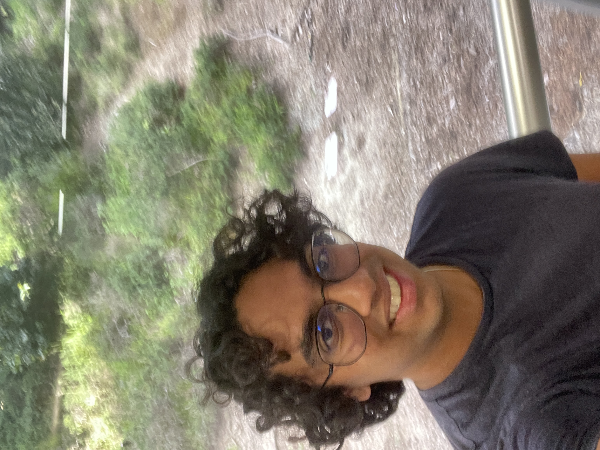
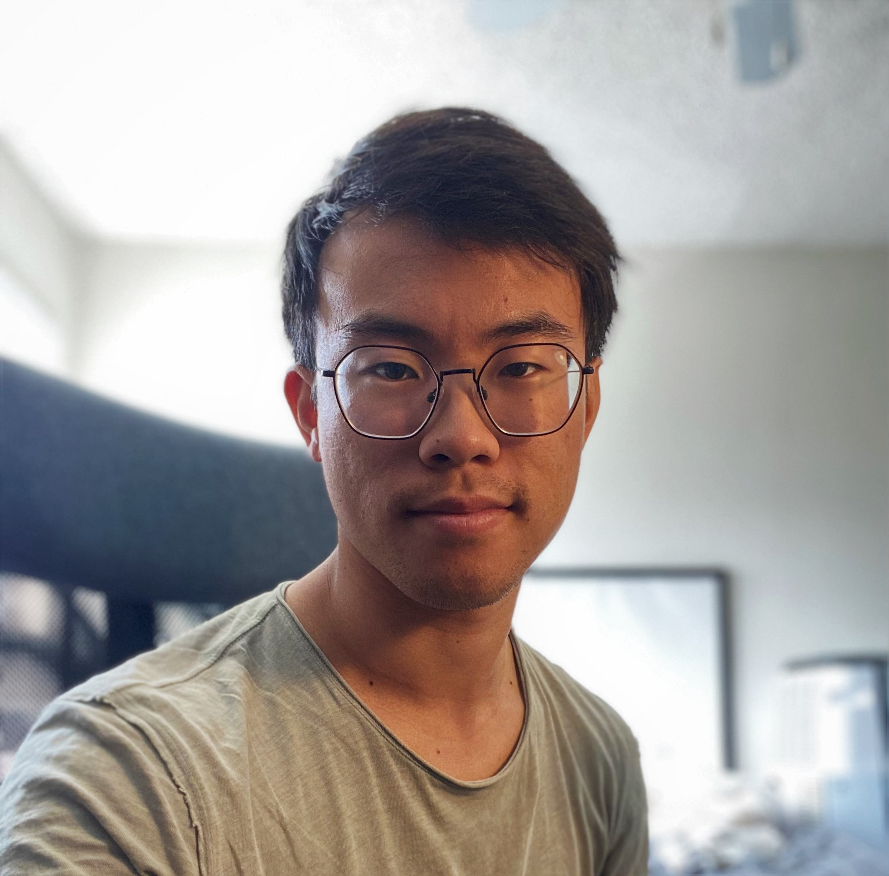
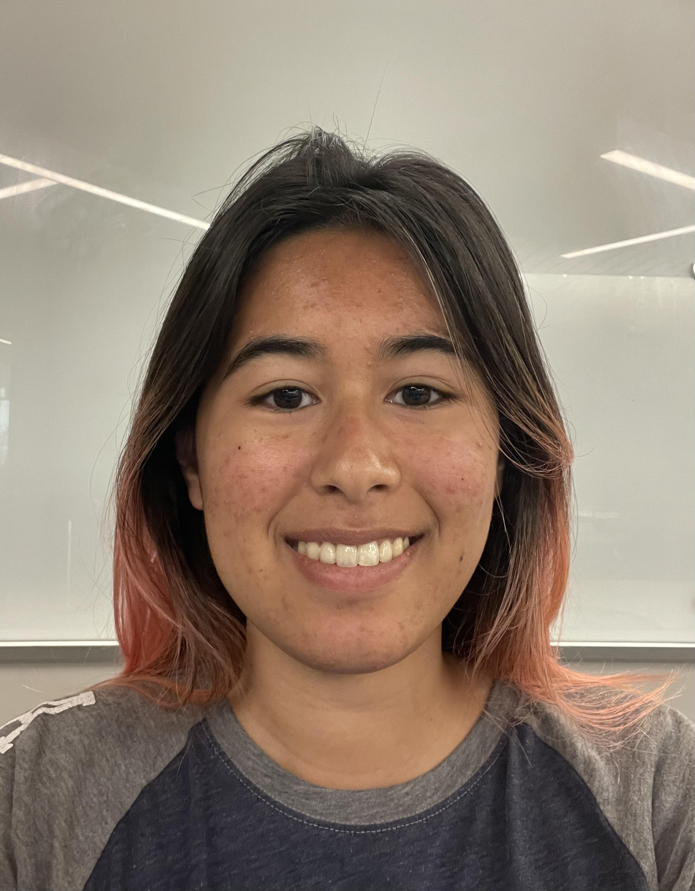
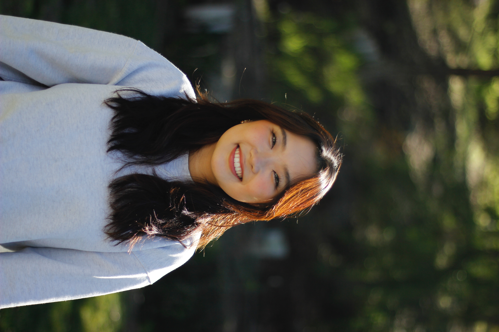

#  Net Ninjas' Webpage 

## Meet The Team!

| | |
|:-------------------------:|:-------------------------:|
|
Varun Sreedhar  Leader  Bio: One fun fact about me is I once made my own fountain pen. Somethings that I am currently interested in is cryptography which is something that I have been studying a lot lately. Some hobbies that I have are going on walks, hanging out with friends, and watching movies.
|
Nicholas Nakano  Leader  Bio: I love music! I play piano, guitar, saxophone and bass. If you don't catch me jamming out in the practice rooms at CPMC, you'll find me working on my car or racing it on the track!
|
|
Melody Gill  (Developer)  Bio: Hello, I'm one of the developers on our team. In my free time I like to crochet, and I've been getting into aerial silks as well. A fun fact about me is that I have 3 extra bones in each foot!
|
Christina Tan  Developer Bio:
|
|
Wincy Liang  Developer Bio: I enjoy playing the piano and building LEGO blocks (I prefer sets with a large number of pieces as they are more challenging) whenever I am free. Sometimes, I also like practicing calligraphy, although I'm not a patient person and will usually get bored after writing for half an hour. One interesting thing about me is that I once spent most of the day hiking to see the sunrise. I got up around 3am and continue climbing to the highest peak to get a better view of the sunrise. It was exhaustion but worthy.:D
|
Jisol Park  Developer Bio: Some of my hobbies are snowboarding, pottery and reading! I like finding new study spots in San Diego and I love spicy food!
|
|
Mary Hu  Developer Bio: Fun fact: my birthday is 2^10...okay maybe not that fun :)) Hobbies: I like jigsaw puzzle!!
|
Tim Lacaba  Designer Bio: Fun fact: I transferred from a community college in the Bay. My hobbies consist of camping and playing video games. I really want to learn Filipino so I can visit the Philippines and explore on my own. 
|
|
Jim Liu  Developer Bio: I like to play Poker and ride mortorcycle. I also go to the gym sometimes. I have a pair of parrot and 6 button quails in my home and I am planning to hatch more quails in the future 
|
Luke Luo Developer Bio: I’m interested in coding, traveling and delicious food.
|

---

## Our GitHub Repository

Link: https://github.com/cse110-sp23-group14/cse110-sp23-group14

   

