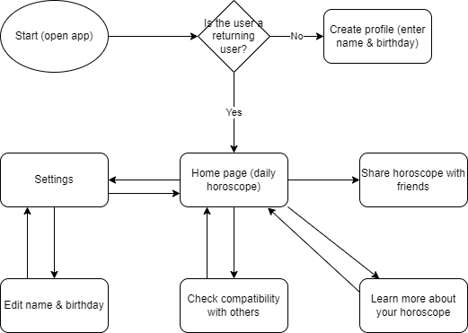
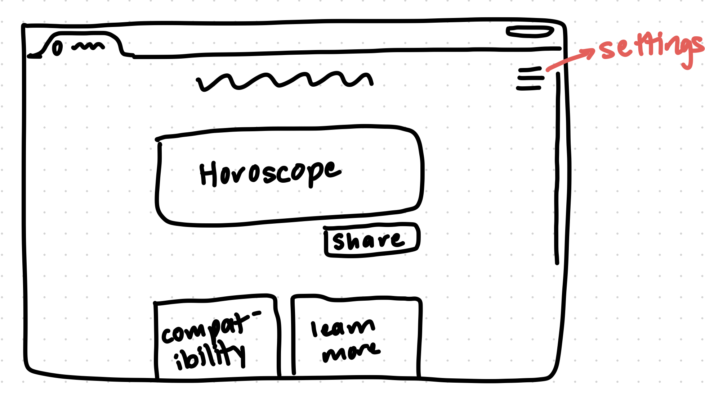
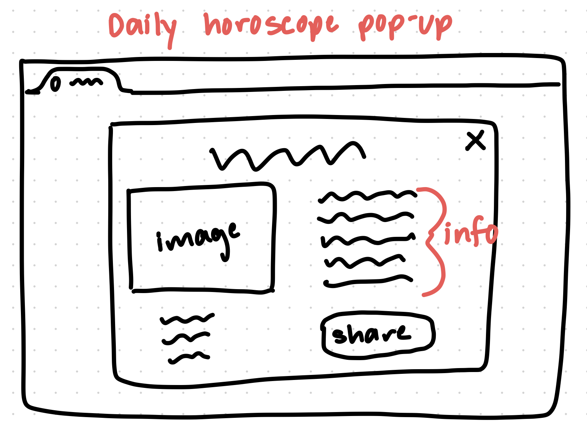
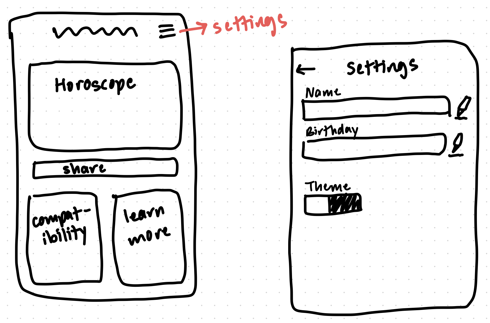

# **Pitch**

## <ins>**Introduction**</inns>

### *What is fortune-telling?*
Fortune-telling is the act of trying to gain information about the future. This information could be anything ranging from the weather or to more complex topics like love. Fortune-telling is widespread, found in many cultures across the world in a wide variety of forms. Now, whether or not any of the information gained through these methods is accurate or useful is *highly* questionable. However, whether those who engage with it actually believe it works or merely see it as an entertaining activity, fortune-telling will continue to live on in an age lacking in superstition.

## <ins>**Our Purpose**</ins>
* Provide users with a fun and convenient way to explore their future
* Tools for decision making (help break past decision paralysis)
* Gain inspiration
* Deeper understanding of themselves
* Social interaction, friends

## <ins>**Who is using it?**</ins>

### Persona 1: Chad
> Chad is a 30-year-old who is curious about his future. He downloads a fortune-telling app and uses its horoscope feature to get an outlook on the rest of his day. He begins to take the horoscopes seriously, and begins to tailor his life choices around them. After beginning this, he's felt like he's had a lot more confidence in his path in life. 

> Wants:
- Wants to be more confident in life
- Wants guidance and direction in his life
- Wants purpose and clarity 
> How our App helps:
- Allows Chad a way to overcome indecision and make him more confident with his choices
- Allows chad to be more prepared for his life choices and therefore he can feel more control of his life

### Persona 2: Samantha
> Samantha, a 25-year-old student, is unsure about her career path. She downloads a fortune-telling app and asks about her future. The app generates a tarot card spread and advises her to pursue her passion for writing. Samantha takes a creative writing class, gains confidence, and becomes a freelance writer. She credits the app for giving her clarity and confidence.

> Wants:
- Know more about her personality and ability
- Gain long-term confidence and encouragement from some credible app.
>How our app help:
- Link zodiac sign to user’s birthday
- Show zodiac’s general quality
- Send daily horoscope

### Persona 3: John
> John is a graphic designer. He is married and has two young children. John is passionate about his work and enjoys taking on new design projects. He is also an avid gamer and enjoys playing video games in his free time. John values his family time and wants to be able to balance his work and personal life effectively. He wants astrological advice on time management in order to live each day in proper alignment with the planets.

> Wants:
- Help him decide what he should spend time on each day and how much time on each part of his life
- Help him see more clearly what he valued most in his life
- Be more confident and have a happier and more balanced life
> How our app helps:
- Give personal advice to John and aid his daily time decision
- Give more confidence to John that he is doing the right thing

### Persona 4: Amy  
> Amy is a 21-year old, majoring in Biotech, but works as a barista at Starbucks to pay for her school supplies. She got into astrology a long time ago, and so she is fully invested in astrology. She downloads an astrology application because she feels like she wants a place where she can recieve a daily horoscope to consult every morning before she walks out the door. After getting the app, she's had a lot of help bringing some order to her days thanks to the daily horoscope. She even checks up on her friends whose signs recieved bad reads for the day.

> Wants:
- a place where she can receive a daily horoscope to consult every morning before she walks out the door. 
- order to her days thanks to the daily horoscope. 
- A way to connect with and care for her friends
> How our app helps:
- accurate readings with relevant information for her day
- Easy way to share readings with others

## <ins>**The Product**</ins>
A horoscope/astrology app that allows users to receive their daily horoscopes as well as learn more about how horoscopes work 

### **Features**:
* Daily horoscopes based on user's birthday
    * Will also include other astrological phenomena such as:
        * Planets in retrograde
        *  Rising Signs
        * 
* Social aspect: you can share your horoscope with friends
  * Copy/paste like Wordle
* Compatiblity checker: enter another person's birthday and we will show level of astrological compatibility
* chatbot or chat room (not sure)
* Personalized account
* Compatibility checker
* Feedback and improvement
* Community feature

### **Visual Representations**  

#### Flow Chart

#### App Visuals Ideas

### **Risks and Rabbit Holes**
(Things we are calling out as difficult up front)
* Technical Risks/Rabbit Hole/Extensions:
   * Adding databases to get data on astrological events
   * Real time chat with psychic
   * Privacy concerns if we do connect to internet
   * We need to get astrology right to not offend the people who truly believe in it
   * Developing accurate and insightful interpretations for the app’s divination features can be challenging
   * Progressive Web App
* User Risks/Rabbit Holes/Extensions:
   * There is a risk that users may become overly reliant on the app’s predictions or interpretations and develop unrealistic expectations or false hope
   * Negative experience if  users find answers to be inaccurate or misleading
   * May cause some mental health problems

